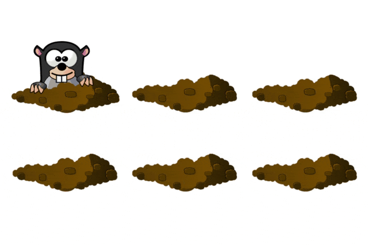

# Child-Computer Interaction database: ChildCIdb_v1

## Table of content

- [Article](#article)
- [Description of ChildCIdb_v1](#description-of-childCIdb_v1)
- [Acquisition Process](#acquisition-process)
    - [Block 1: Emotional State Analysis](#block1)
        - [Test 0: Emotional State Self-Assessment](#test0)
    - [Block 2: Touch Analysis](#block2)
        - [Test 1: Tap and Reaction Time](#test1)
        - [Test 2: Drag and Drop](#test2)
        - [Test 3 and 4: Zoom-in and Zoom-out](#test34)
    - [Block 3: Stylus Analysis](#block3)
- [Download ChildCIdb_v1](#download-childCIdb_v1)
        
## Article

R. Tolosana, J.C. Ruiz-Garcia, R. Vera-Rodriguez, J. Herreros-Rodriguez, S. Romero-Tapiador, A. Morales and J. Fierrez, "[Child-Computer Interaction: Recent Works, New Dataset, and Age Detection](https://arxiv.org/abs/2102.01405)", *arXiv preprint arXiv:2102.01405*, 2021.

## Description of ChildCIdb_v1

**ChildCIdb v1 is the largest publicly available dataset to date for research in the *e-Learning* and *e-Health* areas**. The research carried out with this database aims at generating a better understanding of the cognitive and neuromotor development of children while interacting with mobile devices.

## Acquisition Process

The acquisition process comprises **7 different tests grouped in 3 main blocks**:

* ### <a name="test0">Test 0: Emotional State Self-Assessment</a>
    Only 1 test in which three faces with different colours and facial expressions were represented on the screen, asking the children to touch one according to their emotional state using the finger as input.

    * **Filename:** `info.txt`
    * **File structure:** a *Python dictionary (JSON)* whose keys are `{"timestamp, "emotion", "laterality"}`.  

This block comprises **4 different tests** with different levels of difficulty to see the ability of the children to perform different hand gestures and movements:

* ### <a name="test1">Test 1: Tap and Reaction Time</a>
    The goal is to touch one mole at a time in order to see the ability of the children to perform tap gestures and their reaction times. Once the mole is touched, it disappears from that position and appears in another position of the screen.
    
    

    
    * **Filename:** `tap.txt`
    * **File structure:** A plain text file with tab-separated values where each value is `[x, y, timestamp, x_min, x_max, y_min, y_max, pressure, inMole, touching]` in that order. 

        | Value | Description | Value | Description |
        |:-:|:-:|:-:|:-:|
        | `x` | X-coordinate. | `y_min` | Minimum Y-coordinate of the position of the mole. |
        | `y` | Y-coordinate. | `y_max` | Maximum Y-coordinate of the position of the mole. |
        | `timestamp` | Time instant at which the sample was taken for that row. | `pressure` | Pressure exerted by the child [0,1]. |
        | `x_min` | Minimum X-coordinate of the position of the mole. | `inMole` | Indicates whether the child touches the mole or not. |
        | `x_max` | Maximum X-coordinate of the position of the mole. | `action` | Indicates the type of action the child is performing  (0: starts pen-down, 1: starts pen-up, 2: pen-down). |

 

* ### <a name="test2">Test 2: Drag and Drop</a>
    The goal is to touch the carrot and swipe it to the rabbit.
    
    

    
    * **Filename:** `drag.txt`
    * **File structure:** A plain text file with tab-separated values where each value is `[x, y, timestamp, x_min, x_max, y_min, y_max, pressure, inCarrot, touching]` in that order. 

        | Value | Description | Value | Description |
        |:-:|:-:|:-:|:-:|
        | `x` | X-coordinate. | `y_min` | Minimum Y-coordinate of the position of the rabbit. |
        | `y` | Y-coordinate. | `y_max` | Maximum Y-coordinate of the position of the rabbit. |
        | `timestamp` | Time instant at which the sample was taken for that row. | `pressure` | Pressure exerted by the child [0,1]. |
        | `x_min` | Minimum X-coordinate of the position of the rabbit. | `inRabbit` | Indicates whether the child touches the rabbit or not. |
        | `x_max` | Maximum X-coordinate of the position of the rabbit. | `action` | Indicates the type of action the child is performing  (0: starts pen-down, 1: starts pen-up, 2: pen-down). |

 

* ### <a name="test34">Test 3 and 4: Zoom-in and Zoom-out</a>
    The goal is to enlarge/ the rabbit and put it inside the two red circles for a short time.
    
    

    
    * **Filename:** `more_zoom.txt`
    * **File structure:** A plain text file with tab-separated values where each value is `[x, y, timestamp, x_min, x_max, y_min, y_max, pressure, inCarrot, touching]` in that order. 

  

## Download ChildCIdb_v1
