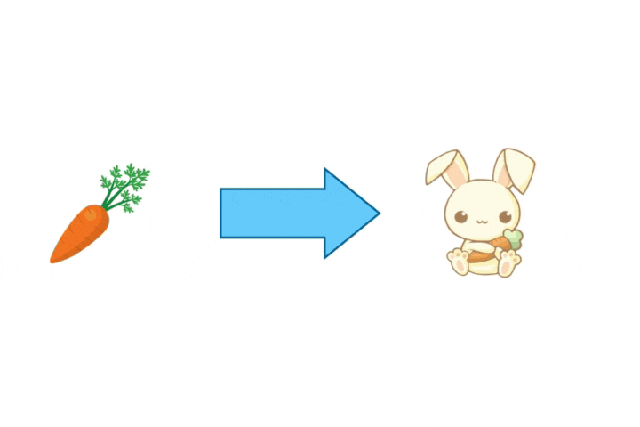
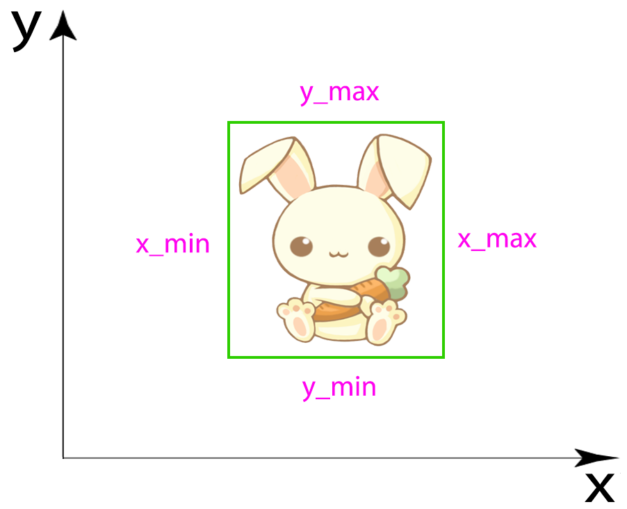
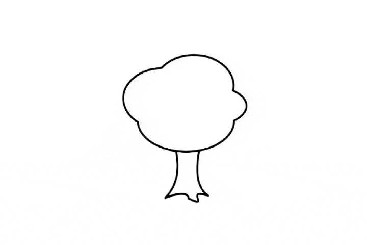

# Child-Computer Interaction database: ChildCIdb (v1)

## Table of content

- [Article](#article)
- [Description of ChildCIdb (v1)](#description)
- [Acquisition Process](#acquisition-process)
    - [Block 1: Emotional State Analysis](#block1)
        - [Test 0: Emotional State Self-Assessment](#test0)
    - [Block 2: Touch Analysis](#block2)
        - [Test 1: Tap and Reaction Time](#test1)
        - [Test 2: Drag and Drop](#test2)
        - [Test 3 and 4: Zoom-in and Zoom-out](#test34)
    - [Block 3: Stylus Analysis](#block3)
        - [Test 5: Spiral Test](#test5)
        - [Test 6: Drawing Test](#test6)
- [Download ChildCIdb (v1)](#download)
        
## Article

R. Tolosana, J.C. Ruiz-Garcia, R. Vera-Rodriguez, J. Herreros-Rodriguez, S. Romero-Tapiador, A. Morales and J. Fierrez, "[Child-Computer Interaction: Recent Works, New Dataset, and Age Detection](https://arxiv.org/abs/2102.01405)", *arXiv preprint arXiv:2102.01405*, 2021.

## <a name="description">Description of ChildCIdb (v1)</a>

**ChildCIdb (v1) is the largest publicly available dataset to date for research in the *e-Learning* and *e-Health* areas**. The research carried out with this database aims at generating a better understanding of the cognitive and neuromotor development of children while interacting with mobile devices. 

This is the first version of an on-going dataset collected in collaboration with the school [GSD Las Suertes](https://www.gsdeducacion.com/colegios.aspx?colegio=5) in Madrid, Spain. **It comprises one capturing session with 438 children in total in the ages from 18 months to 8 years, grouped in 8 different educational levels** according to the Spanish education system. 

**Regarding the gender, 50% of the children were male/female whereas for the handedness, 84% were right-handed**. In addition, other information taken into account has been: ***i)* the previous experience of the children with mobile devices, *ii)* the children’s grades at the school, and *iii)* information regarding the attention-deficit/hyperactivity disorder (ADHD).**  

| Version | Ages  of participants | #Participants | Acquisition tool | Emotion | ADHD | Grades | Previous experience |
|:-:|:-:|:-:|:-:|:-:|:-:|:-:|:-:|
| v1 | 18 months - 8 years | 438 | Finger/Stylus | ✔️ | ✔️ | ✔️ | ✔️ |

 

## Acquisition Process

The acquisition process comprises **7 different tests grouped in 3 main blocks: *1) Emotional State Analysis, 2) Touch Analysis, and 3) Stylus Analysis.***

* ### <a name="test0">Test 0: Emotional State Self-Assessment (10 seconds)</a>
    Only 1 test in which three faces with different colours and facial expressions were represented on the screen, asking the children to touch one according to their emotional state using the finger as input.

    * **Filename:** `info.txt`
    * **File structure:** a *Python dictionary (JSON)* whose keys are `{"timestamp, "emotion", "handedness"}`.  

The second block comprises **4 different tests** with different levels of difficulty to see the ability of the children to perform different hand gestures and movements:

* ### <a name="test1">Test 1: Tap and Reaction Time (30 seconds)</a>
    The goal is to touch one mole at a time in order to see the ability of the children to perform tap gestures and their reaction times. Once the mole is touched, it disappears from that position and appears in another position of the screen.
    
    

    
    * **Filename:** `tap.txt`
    * **File structure:** A plain text file with tab-separated values where each column value is `[x, y, timestamp, x_min, x_max, y_min, y_max, pressure, inTarget, action]` in that order. 

        | Value | Description | Value | Description |
        |:-:|:-:|:-:|:-:|
        | `x` | X-coordinate. | `y_min` | Minimum Y-coordinate value for the mole. |
        | `y` | Y-coordinate. | `y_max` | Maximum Y-coordinate value for the mole. |
        | `timestamp` | Time instant at which the sample was taken for that row. | `pressure` | Pressure exerted by the child [0,1]. |
        | `x_min` | Minimum X-coordinate value for the mole. | `inTarget` | Indicates whether the child is touching the mole or not. |
        | `x_max` | Maximum X-coordinate value for the mole. | `action` | Indicates the type of action the child is performing  (0: starts pen-down, 1: starts pen-up, 2: pen-down). |

        In order to facilitate the comprehension of some values, the subset of `x_min, x_max, y_min, y_max` help us to identify the mole within the test coordinate system. Using these 4 values, a bounding box is formed which indicates the position, height and width of the mole on the plane.
        
        

 

* ### <a name="test2">Test 2: Drag and Drop (30 seconds)</a>
    The goal is to touch the carrot and swipe it to the rabbit.
    
    

    
    * **Filename:** `drag.txt`
    * **File structure:** A plain text file with tab-separated values where each column value is `[x, y, timestamp, x_min, x_max, y_min, y_max, pressure, inTarget, action]` in that order. 

        | Value | Description | Value | Description |
        |:-:|:-:|:-:|:-:|
        | `x` | X-coordinate. | `y_min` | Minimum Y-coordinate value for the rabbit. |
        | `y` | Y-coordinate. | `y_max` | Maximum Y-coordinate value for the rabbit. |
        | `timestamp` | Time instant at which the sample was taken for that row. | `pressure` | Pressure exerted by the child [0,1]. |
        | `x_min` | Minimum X-coordinate value for the rabbit. | `inTarget` | Indicates whether the child is touching the carrot or not. |
        | `x_max` | Maximum X-coordinate value for the rabbit. | `action` | Indicates the type of action the child is performing  (0: starts pen-down, 1: starts pen-up, 2: pen-down). |

        In order to facilitate the comprehension of some values, the subset of `x_min, x_max, y_min, y_max` help us to identify the rabbit within the test coordinate system. Using these 4 values, a bounding box is formed which indicates the position, height and width of the rabbit on the plane. ***This concept can be applied equally to tests 3 and 4.***
        
        

 

* ### <a name="test34">Test 3 and 4: Zoom-in and Zoom-out (30 seconds each)</a>
    The goal is to enlarge/decrease the rabbit and put it inside the two red circles for a short time.
    
    

        
        
    

    
    * **Filename:** `more_zoom.txt` and `less_zoom.txt`
    * **File structure:** A plain text file with tab-separated values where each column value is `[x, y, timestamp, xCircle, yCircle, r1, r2, x_min, x_max, y_min, y_max, scale, pressure, inTarget, action]` in that order.  

    | Value | Description | Value | Description |
    |:-:|:-:|:-:|:-:|
    | `x` | X-coordinate. | `x_min` | Minimum X-coordinate value for the rabbit. |
    | `y` | Y-coordinate. | `x_max` | Maximum X-coordinate value for the rabbit. |
    | `timestamp` | Time instant at which the sample was taken for that row. | `y_min` | Minimum Y-coordinate value for the rabbit. |
    | `x_Circle` | X-coordinate of the centre of the circles. | `y_max` | Maximum Y-coordinate value for the rabbit. |
    | `y_Circle` | Y-coordinate of the centre of the circles | `pressure` | Pressure exerted by the child [0,1]. |
    | `r1` | Radius of the inner circle. | `inTarget` | Indicates when the rabbit is between the two red circles. |
    | `r2` | Radius of the outer circle | `action` | Indicates the type of action the child is performing  (0: starts pen-down, 1: starts pen-up, 2: pen-down first finger, 3: pen-down second finger). |

  

The third block aimed to analyse the ability of the children using the pen stylus by means of **2 different tests**:

* ### <a name="test5">Test 5: Spiral Test (30 seconds)</a>
    The goal is to go across the spiral from the inner part to the outer part, trying to keep it always in the area remarked in black colour.
    
    

    
    * **Filename:** `test1.txt`
    * **File structure:** A plain text file with tab-separated values where each column value is `[x, y, timestamp, pressure, inTarget, action]` in that order.  
    
    | Value | Description | Value | Description |
    |:-:|:-:|:-:|:-:|
    | `x` | X-coordinate. | `pressure` | Pressure exerted by the child [0,1]. |
    | `y` | Y-coordinate. | `inTarget` | Indicates whether the child draws inside the spiral or not. |
    | `timestamp` | Time instant at which the sample was taken for that row. | `action` | Indicates the type of action the child is performing  (0: starts pen-down, 1: starts pen-up, 2: pen-down). |
    
 

* ### <a name="test6">Test 6: Drawing Test (2 minutes)</a>
    The goal is to colour the top and trunk of the tree in the best way possible trying to filling it completely and draw always inside the area remarked in black colour.
    
    

    
    * **Filename:** `test2.txt`
    * **File structure:** A plain text file with tab-separated values where each column value is `[x, y, timestamp, pressure, inTarget, action]` in that order.  
    
    | Value | Description | Value | Description |
    |:-:|:-:|:-:|:-:|
    | `x` | X-coordinate. | `pressure` | Pressure exerted by the child [0,1]. |
    | `y` | Y-coordinate. | `inTarget` | Indicates whether the child draws inside the tree or not. |
    | `timestamp` | Time instant at which the sample was taken for that row. | `action` | Indicates the type of action the child is performing  (0: starts pen-down, 1: starts pen-up, 2: pen-down). |
    
  

## <a name="download">Download ChildCIdb (v1)</a>

1. Download your corresponding license agreement:

    [[link](http://atvs.ii.uam.es/atvs/)] Permanent researchers working at research or academic institutions, and selected companies generating research outcomes > **full research access to ChildCIdb (v1).**
    
    [[link](http://atvs.ii.uam.es/atvs/)] Independent researchers, developers, students, and companies > limited ChildCIdb (v1) access **solely for the purpose of the SVC 2021 competition.**    

    Once the corresponding license agreement is signed, send the scanned copy to atvs@uam.es according to the instructions given in point 2.

2. Send an email to [**atvs@uam.es**](mailto:atvs@uam.es), as follows:

    _Subject:_ **[DATABASE download: ChildCIdb (v1)]**

    Body: Your name, e-mail, telephone number, organization, postal mail, purpose for which you will use the database, time and date at which you sent the email with the signed license agreement.

3. Once the email copy of the license agreement has been received at ATVS, you will receive an email with a username, a password, and a time slot to download the database.

4. [Download the database](http://atvs.ii.uam.es/atvs/intranet/), for which you will need to provide the authentication information given in step 

5. After you finish the download, please notify by email to [**atvs@uam.es**](mailto:atvs@uam.es) that you have successfully completed the transaction.

6. For more information, please contact: [**atvs@uam.es**](mailto:atvs@uam.es)
